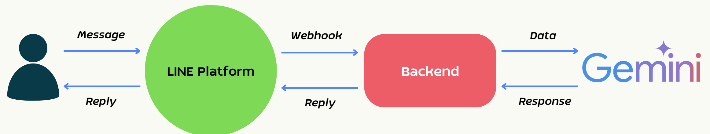

# Technical Test for Internship Program — LINE RAG Chatbot
> Please follow the instructions below to complete the test.
---
### **Task Overview**  
Develop a **Generative AI Chatbot** that integrates with **LINE** and utilizes **LLM API** for response generation. Implement **Retrieval-Augmented Generation (RAG)** to enhance responses based on uploaded text documents.

  

## Instructions

### 1. Backend
- Develop the chatbot backend using **FastAPI**

### 2. Document Upload & Storage
- Provide an API endpoint to **upload documents** 
- Supported file types: **`.pdf` and `.txt`**
- Store uploaded files in **memory or temporary storage** — `no database required`

### 3. Retrieval-Augmented Generation (RAG)
- Implement a RAG pipeline:
  - When a user sends a message, retrieve relevant text chunks from uploaded documents
- Use **in-memory search** or **vector database**, whichever you prefer.

### 4. Language Model
- Use any LLM API of your choice.
- The model must generate responses in Thai or English depending on what the user writes.

### 5. LINE OA Integration
- Connect the chatbot to **LINE Messaging API**
- Handle incoming messages via Webhook and reply in real time
- You need to find the way to connect your Backend with Line OA **(Trust me it's not hard :))**

### 6. Code & Repository
1. Push the completed project to a **public GitHub repository** (No need to push `ENV`)
2. Include a clear **`README.md`** covering:
   - First Paragraph contain with FULLNAME + INTERNSHIP YEAR eg. **JHON DOE 1975**
   - How to install dependencies
   - How to set up environment variables
   - How to run the project
   - List of all API endpoints

---

## Extra Score

Complete any of the following to earn additional points. Each item is independent.

### Extra 1 — Vector Database
- Replace in-memory keyword search with a vector database
- Use embedding models to encode documents and retrieve by semantic similarity

### Extra 2 — Additional File Types for Uploading and Retrieval
- Support uploading **CSV or Excel files**
- Support uploading **images** 

### Extra 3 — Chat History
- Track conversation history per user
- Pass previous messages as context to the LLM so the bot can understand follow-up questions

---

## Evaluation Criteria
| Criteria | Score | Description |
|---|---|---|
| RAG Pipeline | 40 pts | Retrieval is relevant and context is properly injected into the prompt |
| Code Quality | 30 pts | Well-structured, readable, documented code and clear README |
| Correct Response | 20 pts | Bot answers accurately using content from uploaded documents |
| LINE Integration | 10 pts | Webhook works end-to-end; messages received and replied correctly |

## Extra Evalutation Critieria
| Criteria | Score | Description |
|---|---|---|
| Vector DB | + 10 pts | Semantic retrieval implemented with a vector database |
| More File Types | + 10 pts | CSV, Excel, or image files parsed and indexed for RAG |
| Chat History | + 10 pts | Conversation context passed to LLM; bot handles follow-ups correctly |

---
No things are perfect we just want to know you. `Good Luck !!`

`Authors by JATURAWICH and NIPITPON`
